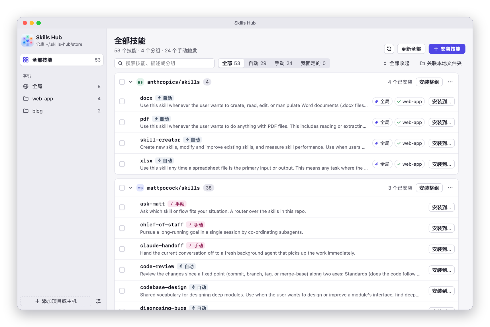
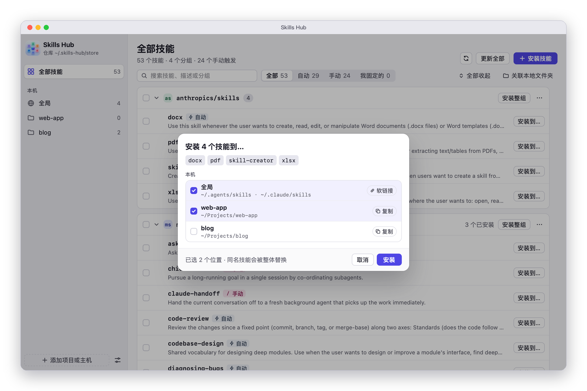
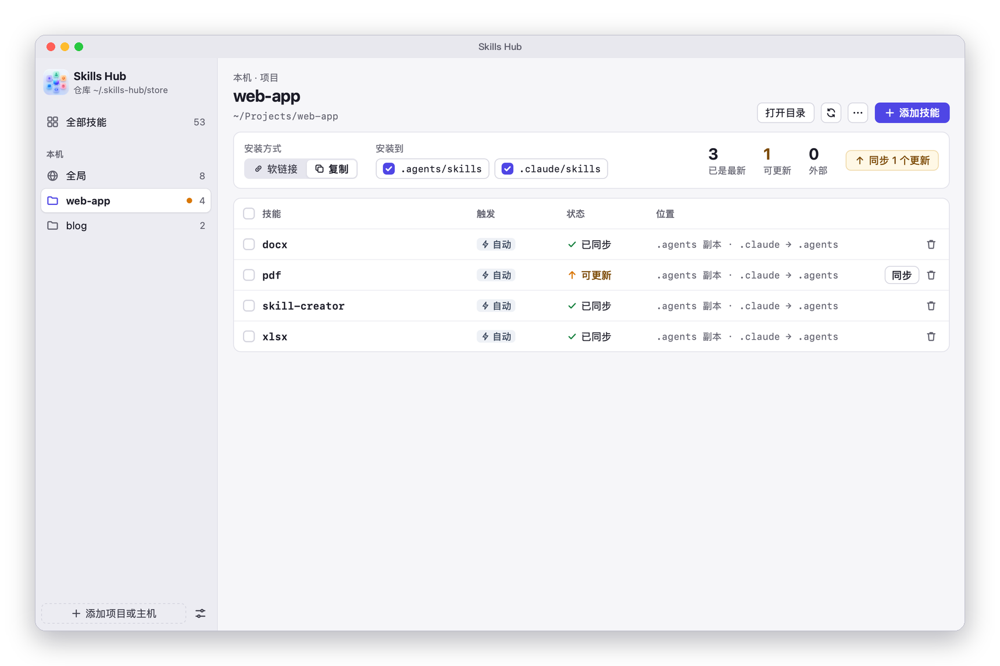
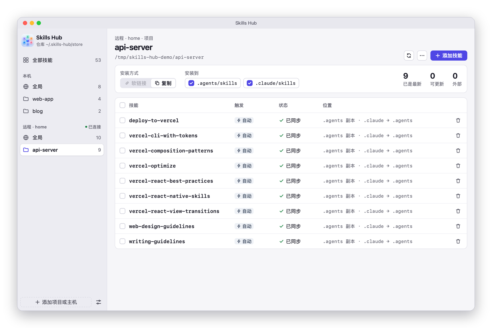
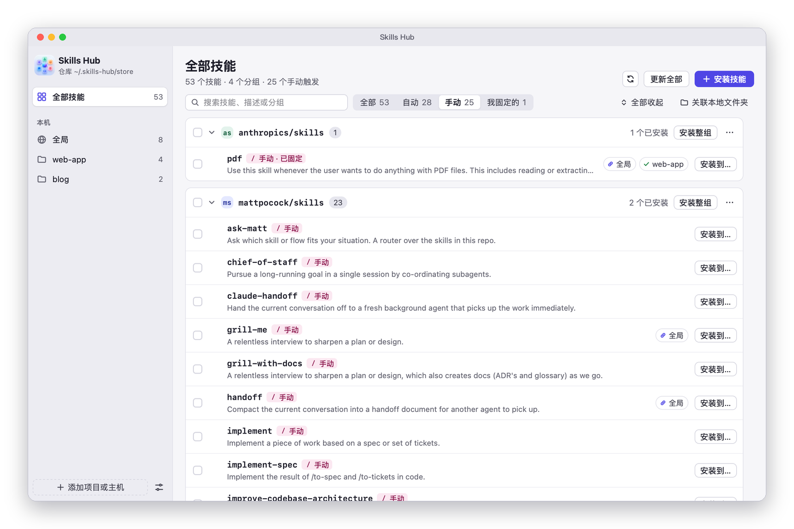

<p align="center">
  
</p>

<h1 align="center">Skills Hub</h1>

<p align="center">
  在一个地方管理所有 Agent Skills：装进仓库，再分发到全局或各个项目，本机或 SSH 主机都行。
</p>

<p align="center">
  Inspired by <a href="https://github.com/what1f/kitter">Kitter</a> · Built with <a href="https://github.com/egoist/mygo">MyGo</a>（Go + React）
</p>



## 功能

- **一个仓库装下所有技能**：粘贴 skills.sh 上的 `npx skills add` 命令即可安装，也能关联自己写技能的本地文件夹。
- **分发到任何地方**：全局用软链接，改了立即生效；项目用复制，可以提交到 Git。同时兼容 `.agents/skills` 和 `.claude/skills`。
- **远程主机**：通过 SSH 管理其他机器上的全局目录和项目。
- **分组**：按来源仓库自动分组，也可以自己命名，整组安装、更新、删除。
- **手动 / 自动触发**：识别 Claude Code 和 Codex 各自的设置，可以固定成你想要的，技能更新后依然保持。
- **状态一目了然**：每个项目里哪些已同步、哪些落后于仓库、哪些不是从这里装的，落后的一键同步。

| 分发到全局和项目 | 项目里装了什么 |
| --- | --- |
|  |  |

| 远程主机上的项目 | 只看手动触发的技能 |
| --- | --- |
|  |  |

## 运行

```sh
bun install
bun run dev      # 开发，热重载
bun run build -- -skip-dmg -skip-notarize   # 打包到 build/darwin-arm64/Skills Hub.app
go test ./...    # 后端测试；SKILLS_HUB_TEST_HOST=home 时同时测远程安装
```

需要 Go 1.27+ 和 Bun。

## 工作方式

- **仓库**：`~/.skills-hub/store`（可在设置里改）。「安装技能」会在这里执行 `npx skills add <包> -a universal -y`，技能落在 `store/.agents/skills/`，来源记录在 `skills-lock.json`。更新即 `npx skills update`。
- **本地文件夹**：关联放着自己写的技能的文件夹，技能直接从原位置读取，不复制进仓库。
- **分组**：默认按来源仓库（或本地文件夹名）分组，可以给任意技能改分组。映射存在配置里，不影响磁盘上的目录。
- **手动 / 自动触发**：读取 Claude Code 的 `disable-model-invocation`（`SKILL.md` frontmatter）和 Codex 的 `policy.allow_implicit_invocation`（`agents/openai.yaml`）。可以把技能固定为手动或自动：选择记在配置的 `triggers` 里，并直接写进技能的这两个文件；技能从源头更新后，app 会把你的选择重新写回去。
- **目标**：全局（`~`）或项目目录，本机或 SSH 主机。每个目标可选装到 `.agents/skills`、`.claude/skills`，或两者。
  - 软链接：两个目录都直接链接到仓库里的技能。本机全局的默认方式。
  - 复制：`.agents/skills` 里放副本，`.claude/skills` 用相对链接指过去，可以提交到 Git。项目的默认方式；远程主机只能复制。
- **状态**：不在目标里写任何标记文件，靠名字和内容哈希比对——已链接 / 已同步 / 可更新 / 同名冲突 / 外部（不是从这里装的）。

配置在 `~/.skills-hub/config.json`。

## 代码

| 文件 | 内容 |
| --- | --- |
| `config.go` | 配置的读写 |
| `skills.go` | 扫描仓库和本地文件夹，内容哈希、复制、打 tar |
| `trigger.go` | 手动 / 自动触发的识别与改写 |
| `targets.go` | 扫描目标、安装、删除（本机与 SSH） |
| `api.go` | 绑定给前端的 `Hub` 服务，以及仓库的 npx 命令 |
| `src/App.tsx` | 界面 |
| `src/mygo.ts` | 由 `mygo generate` 生成的类型化客户端 |
